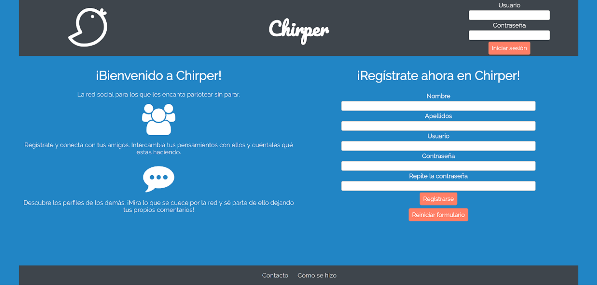
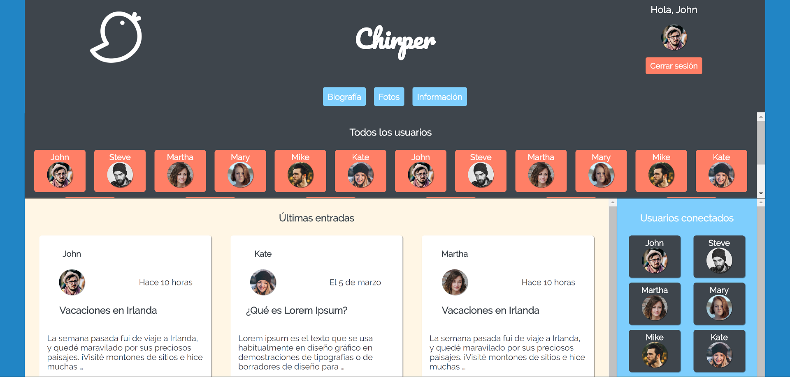

# Chirper
> Una red social donde puedes registrarte y publicar entradas, y comentar en las de otros usuarios.

Chirper es una página web creada desde cero, totalmente adaptada para dispositivos móviles (smartphones y tablets), y creada con el uso de nuevas tecnologías CSS como Flexbox y Grid.

Este es el proyecto final de la asignatura Programación Web del Grado en Ingeniería Informática de la Universidad de Granada.

## Instalación

Descárgate el repositorio y extrae el contenido en tu ordenador. Existen dos versiones de la página web:

* En la carpeta `Mockup` hay disponible una versión estática del sitio web, un prototipo que no tiene funcionalidad y sirve como muestra del interfaz de usuario.
  * Ejecuta el archivo `index.html` en tu navegador de Internet para iniciar la página web.

* En la carpeta `Project` existe la versión funcional de Chirper, con los formularios funcionando y creando registros en la base de datos.
  * Ejecuta el archivo `index.php` en tu navegador de Internet para iniciar la página web.
  * Necesitas una instalación de un servidor web para poder ejecutar Chirper.

## Historial de versiones

* 1.0.0
  * Primera versión

## Información sobre el proyecto

Juanjo Jiménez – [@xXJuAnJi05Xx](https://twitter.com/xXJuAnJi05Xx)

Distribuido bajo la licencia MIT. Consulta el archivo ``LICENSE`` para más información.

[https://github.com/xXJuAnJi05Xx/PW-1617](https://github.com/xXJuAnJi05Xx/PW-1617)
